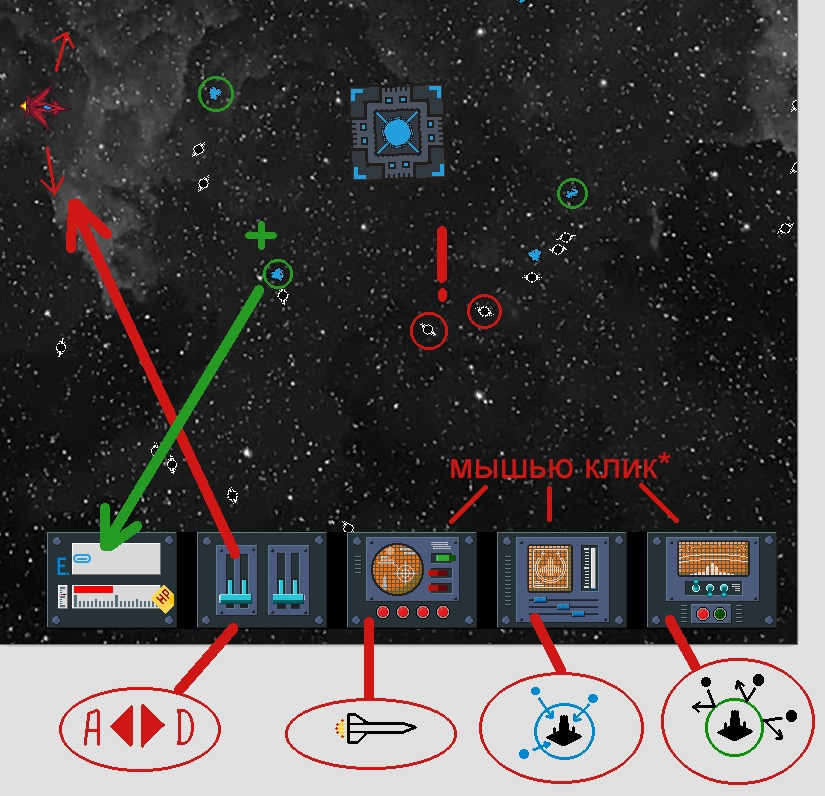

# Игра "Космический герой"
___

### Описание игры:
Игрок на космическом корабле пытается уничтожить злобную Станцию, 
которая разбрасывает в космос "черные дыры" наносящие вред. 
При попадании ракеты в Станцию из нее выбиваются осколки "энергии"
(камни синего цвета), которые необходимо собирать. 

При наборе 1000 очков энергии (энергия бывает разной стоимости от 10..30 Е),
открывается магазин в котором можно купить улучшения для корабля:
> Увеличение скорости корабля: 200 Е; 
>
> Уменьшение скорости корабля: 100 Е;
>
> Усиление ракет (следующий тип): 500 Е;
>
> Увеличение скорости ракет: 800 Е;
> 
> Уменьшение времени ожидания ракет: 400 Е;
> 
> Усиление магнитного поля: 500 Е;
> 
> +10 к жизни корабля: 200 Е;
> 
> +20 к жизни корабля: 300 Е;
> 
> Удар по станции (-100 жизней): 1200 Е.

По завершении покупок остатки не потраченной энергии переходят в банк
(они будут доступны при следующем посещении магазина). Происходит переход
на следующий уровень. Игра сохраняется.

Для получения информации о состоянии процесса необходимо нажать на "пробел",
игра будет поставлена на паузу.

### Цель игры:
Уничтожить станцию попадая по ней ракетами. Победа - станция уничтожена.
Проигрыш - жизни корабля опустились до 0.

### Управление:
Для управления кораблём используются кнопки влево/вправо или A / D, 
для запуска ракет, магнитного и защитного поля клик мыши по соответствующей
панели (см. инструкцию)  
___

### Инструкция игры в одной картинке:


___

#### Используемые библиотеки:
+ pygame - *(основные ресурсы)*
+ pickle - *(сохранения игры)*
+ sys - *(системные функции)*
+ random - *(элементы случайностей)*
+ math - *(расчеты координат через углы)*

#### Список папок и файлов:
Если их скопировать в пустой проект и установить pygame, всё будет работать.
```
font
images
save
sound
ico.png
main.py (основной)
Readme.md (вы его читаете)
requirements.txt
setting.py
```
>> Создано на python 3.10


 